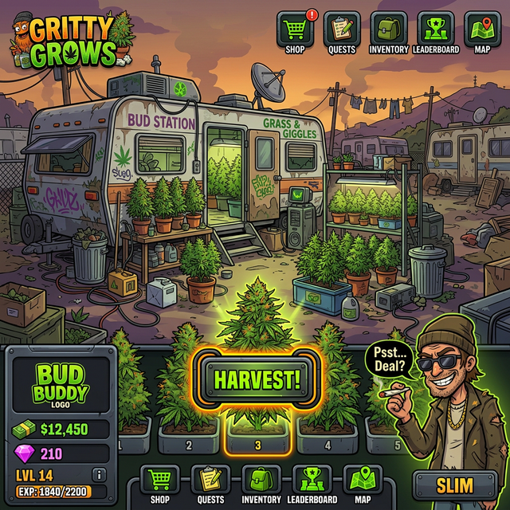

# 🌿 WeedEmpire 🌿

> **Start in a trailer park. End up running a global cartel. How big can you grow?**

Welcome to **WeedEmpire**, the ultimate idle growing and business simulation game! Featuring a gritty, satirical, cartoon-vector aesthetic inspired by your favorite trailer park hustlers, this game puts you in charge of building the most massive, lucrative empire the streets have ever seen.

  

---

## 🚀 The Hustle Starts Here
Your goal is simple: Grow it, sell it, and don't get busted (unless it helps you build your Street Cred, of course). You'll start with a single heat lamp in a shady RV park and work your way up to underground bunkers and private islands.

Manage your resources, hire eccentric corner dealers, deal with dynamic market fluctuations, and watch out for the authorities!

## ✨ Features You Can Play Right Now

*   **🌱 Automatic Idle Growing**: Your stash grows even when you're not looking. The game calculates your offline progress, so you wake up to a massive harvest!
*   **🤝 Interactive Customers**: Tap procedurally spawned customers walking across your screen to make quick manual sales.
*   **💼 The Corner Dealer**: Tired of tapping? Hire the Corner Dealer to automate your sales and generate passive income while you sleep.
*   **🚨 The "Get Busted" Prestige System**: The heat is on! If the cops get too close, take the fall to earn permanent **Street Cred**. Use your cred to unlock massive permanent boosts for your next run.
*   **📰 Elite Cabal "Fake News" Events**: Beware the Elite Cabal! These out-of-touch billionaires will launch "Fake News" smear campaigns (like claiming your weed causes spontaneous dancing) to tank your sales. Spend your Street Cred to hire "Truth Tubers" to expose their lies and save your empire!
*   **🎨 Retro or Modern Aesthetics**: Toggle between gritty, old-school pixel graphics or a modern, polished vector art style at any time.

## 🔮 What's Coming Next (Roadmap)

We're constantly expanding the empire. Here is what's on the horizon:
*   **🧬 Multiple Strains**: Unlock legendary strains like "Diamond Kush" or "Moon Rocks" to meet shifting customer demands and maximize profits.
*   **🏢 Real Estate Upgrades**: Move your operation from the Trailer Park to a Suburban Garage, an Underground Bunker, and eventually, a Cartel Mansion!
*   **🧑‍🔬 Employee Gacha System**: Open safes to hire Rare, Epic, and Legendary employees (like Chemists or Cartel Bosses) to boost your global stats.

---

*Ready to build your empire? Plant your first seed and let the hustle begin!* 💸
